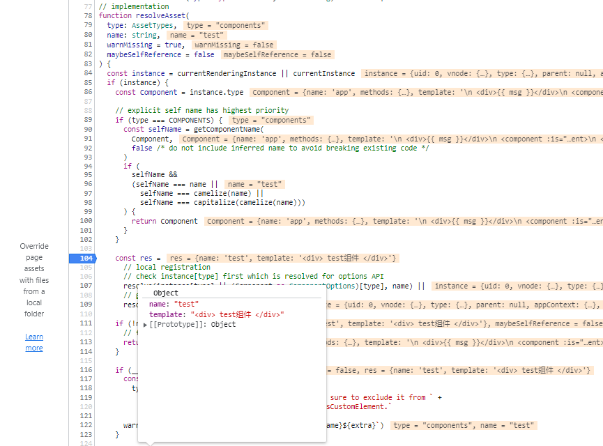
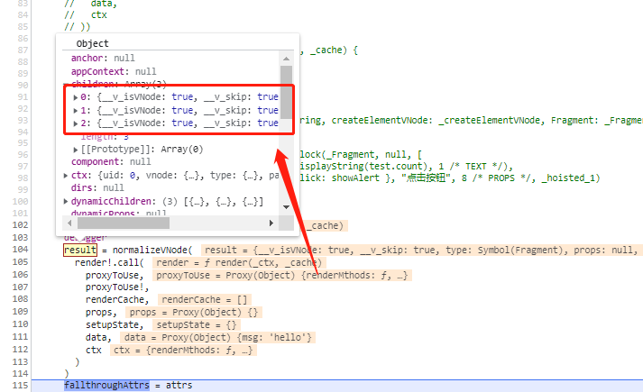
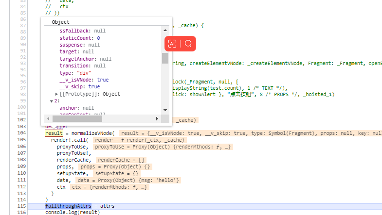

# 组件componet解读

1. 使用component组件的时候，vue的模板编译会编译成`_createBlock(_resolveDynamicComponent("xxxx"))`
```
<component is="test"></component>

_createBlock(_resolveDynamicComponent("test")
```

1-1. `_resolveDynamicComponent`函数 实际上就是Vue.resolveDynamicComponent函数
-->packages\runtime-core\src\helpers\resolveAssets.ts


1-2. resolveDynamicComponent函数接受一个参数，可以是字符串，或者vnode实例
如果是字符串，既组件名称，会执行`resolveAsset`方法，否则直接return传入的参数

```js
export function resolveDynamicComponent(component: unknown): VNodeTypes {
  if (isString(component)) {
    return resolveAsset(COMPONENTS, component, false) || component
  } else {
    // invalid types will fallthrough to createVNode and raise warning
    return (component || NULL_DYNAMIC_COMPONENT) as any
  }
}
```

1-3. 当`resolveDynamicComponent`传入是一个字符串的时候,执行`resolveAsset(COMPONENTS, component, false)`-->packages\runtime-core\src\helpers\resolveAssets.ts

- 判断当前实例，如果有单例, 拿当前实例的type,赋值给Compoent
```js
const instance = currentRenderingInstance || currentInstance

 if (instance) {
    const Component = instance.type
    ...
}
```

- 判断第一个参数是否为`COMPONENTS`,如果是，再判断组件名称和当前的实例组件名称是否一样，如果一样，返回该实例

```js
if (type === COMPONENTS) {
    const selfName = getComponentName(
    Component,
    false /* do not include inferred name to avoid breaking existing code */
    )
    if (
    selfName &&
    (selfName === name ||
        selfName === camelize(name) ||
        selfName === capitalize(camelize(name)))
    ) {
    return Component
    }
}
```

- 逐级获取组件实例,type='componet',
 1：先在当前实例搜索`component`属性，
 2：如果没有，再自己定义的`{xxx}`里面寻找
 3：在全局属性里面找`instance.appContext`的compoent

```js
const res =
      // local registration
      // check instance[type] first which is resolved for options API
      resolve(instance[type] || (Component as ComponentOptions)[type], name) ||
      // global registration
      resolve(instance.appContext[type], name)
```

- 最好返回寻找组件的值`return res`,最终`_createBlock`拿到的是一个对象`{name:'xxx', template: 'xxx'}`
<p>
  
</p>

1-4: `_createBlock`就是`createBlock` (packages\runtime-core\src\vnode.ts)用来生成vnode的

- createVNode 如果传入本事一个vnode, 则return
- 如果是一个`{xxx}`, 就进行处理，最终返回一个vnode

```js
export function createBlock(
  type: VNodeTypes | ClassComponent,
  props?: Record<string, any> | null,
  children?: any,
  patchFlag?: number,
  dynamicProps?: string[]
): VNode {
  return setupBlock(
    createVNode(
      type,
      props,
      children,
      patchFlag,
      dynamicProps,
      true /* isBlock: prevent a block from tracking itself */
    )
  )
}
```

2. 如果是一个动态的component
```
<component :is="renderMthods(_Vue.h)"></component>
-->
_resolveDynamicComponent(renderMthods(_Vue.h)))
```

2-1. 当执行render函数的时候，执行`renderMthods(_Vue.h))`会产生一个vnode对象，当执行`resolveDynamicComponent`
判断改参数不是字符串，直接返回出去
```js
export function resolveDynamicComponent(component: unknown): VNodeTypes {
  if (isString(component)) {
    return resolveAsset(COMPONENTS, component, false) || component
  } else {
    // invalid types will fallthrough to createVNode and raise warning
    return (component || NULL_DYNAMIC_COMPONENT) as any
  }
}
```

3. 最终生成完整的vnode

<p>
  
  
</p>

4. 渲染vnode，成为真实DOM，完成


## 隐藏技巧

```html
<component :is="renderMthods(_Vue.h)"></component>
<component is="test"></component>
<component :is="{
        template: '<div>渲染成功</div>'
      }"></component>
<component :is="{
    setup() {
        return () => {
        return _Vue.h('h1', '渲染成功')
        }
    }
}"></component>
```
component四种方式引入组件

- 1.render函数

- 2.指定组件名称

- 3.组件的optionApi

- 4.组件的compistionApi

3,4实际上就是组件的写法，只是写入到`:is='xxx'`里面

## 总结

componet内置组件，通过编译变成了`_createBlock(_resolveDynamicComponent(xxx))`,该函数接受字符串或者其他类型
- 如果是字符串，就会搜索自己自身的组件，全局组件，然后注入进去

- 如果是一个对象字面量, 把它当做组件，注入进去

- 如果是一个vnode，把它当做组件，注入进去

紧接着，执行createVNode函数，会对上面进行判断，最终生成一个vnode

实际上，component内置组件就是处理`引入组件`不同写法，然后统一生成vnode的一个过程


## 相关代码
```js
(function anonymous(
) {
const _Vue = Vue

return function render(_ctx, _cache) {
  with (_ctx) {
    const { toDisplayString: _toDisplayString, createElementVNode: _createElementVNode, resolveDynamicComponent: _resolveDynamicComponent, openBlock: _openBlock, createBlock: _createBlock, Fragment: _Fragment, createElementBlock: _createElementBlock } = _Vue

    return (_openBlock(), _createElementBlock(_Fragment, null, [
      _createElementVNode("div", null, _toDisplayString(msg), 1 /* TEXT */),
      (_openBlock(), _createBlock(_resolveDynamicComponent(renderMthods(_Vue.h)))),
      (_openBlock(), _createBlock(_resolveDynamicComponent("test")))
    ], 64 /* STABLE_FRAGMENT */))
  }
}
})
```

```html
<!DOCTYPE html>
<html lang="en">
  <head>
    <meta charset="UTF-8" />
    <meta name="viewport" content="width=device-width, initial-scale=1.0" />
    <title>Document</title>
    <script src="../../dist/vue.global.js"></script>
  </head>
  <body>
    <div id="app">
        <div>{{ msg }}</div>
        <component :is="renderMthods(_Vue.h)"></component>
        <component is="test"></component>
    </div>
    <script>
      let { createApp } = Vue

      var app = createApp({
        data() {
          return {
            msg: 'hello'
          }
        },
        methods: {
            renderMthods(h, params) {
                return h('h1', '哈哈哈')
            }
        }
      })
      app.component('test', {
        template: `<div> test组件 </div>`,
      })

      app.mount('#app')
    </script>
  </body>
</html>

```

