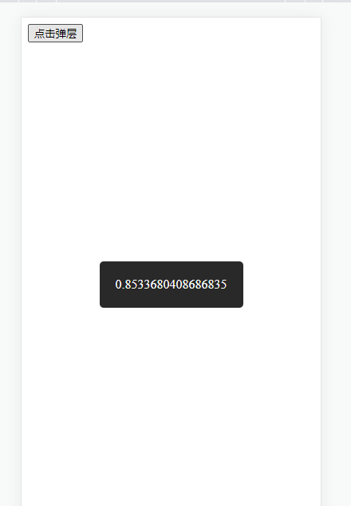

# 函数调用组件-弹层

## 疑问
> 在使用第三方UI库的时候，loading组件，弹窗组件可以通过函数直接调用是怎么做到的呢？
<p>
  
</p>

## 实现流程

1. 定义一个函数，执行createApp函数，来创建一个新的组件。新建一个元素，插入到body页面里面

2. 执行mount方法，传入元素对象，这时候vue就开始执行初始化操作，模板编译成render，生成vnode，渲染正式DOM

2-1. 此时在body下面可以看到Vue新创建的元素节点

3. 缓存该Vue实例，在有需要的时候，执行该实例中的方法

## 总结
这种全局弹窗设计模式属于单例模式，好处就是可以节省资源，保证只有一个弹窗。实现步骤主要也是创建一个新的
Vue实例，在需要的时候，调用该实例中的方法，来显示内容

## 相关代码 
```html
<!DOCTYPE html>
<html lang="en">
<head>
    <meta charset="UTF-8">
    <meta http-equiv="X-UA-Compatible" content="IE=edge">
    <meta name="viewport" content="width=device-width, initial-scale=1.0">
    <title>Document</title>
    <script src="../../dist/vue.global.js"></script>
</head>
<body>
    <div id="app">
        <button @click="showHandle">点击弹层</button>
    </div>
    <script>
        var { createApp  } = Vue;
        let instance = ''
        function createShowInstnace() {
            
            if(instance) {
                return instance
            } else {
                var a = createApp({
                    data() {
                        return {
                            show: false,
                            tips: ''
                        }
                    },
                    template: `
                     <Transition>
                        <div class="tips" v-show="show">{{ tips }}</div>
                     </Transition>
                    `,
                    methods: {
                        showTips(tips) {
                            if(this.show) {
                                this.tips = tips;
                                return
                            };

                            this.show = true;
                            this.tips = tips;

                            this.timer = setTimeout(() => {
                                this.show = false;
                            }, 3000)
                        }   
                    }
                })
                var div = document.createElement('div')
                document.body.appendChild(div)
                instance = a.mount(div)

                return instance
            }
        }

        function $tips(tips) {
            const crateIn = createShowInstnace();

            crateIn.showTips(tips);
        }

        var app = createApp({
            methods: {
                showHandle() {
                    $tips(Math.random())
                }
            }
        })

        app.mount('#app')

    </script>
<style>
    .tips {
        position: fixed;
        max-width: 400px;
        padding: 20px;
        border-radius: 5px;
        background: #000;
        color: #fff;
        text-align: center;
        z-index: 2;
        left: 50%;
        top: 50%;
        transform: translate3d(-50%, -50%, 0);
    }
    .tips.v-enter-active,
    .tips.v-leave-active {
       transition: opacity .8s ease;
    }

    .tips.v-enter-from,
    .tips.v-leave-to {
    opacity: 0;
    }
</style>
</body>
</html>
```