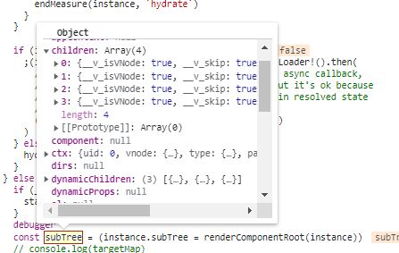
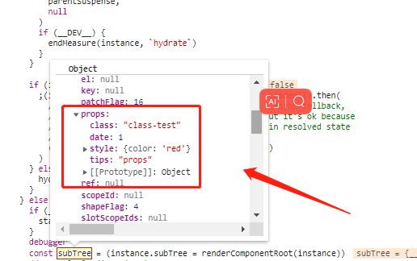

# $attrs 解读

1. 编译template模板生成render函数的时候，可以看到v-bind里面所有的值，会传入mergePorps函数里面，作为第二个参数

2. 生成vnode, 可以看到children里面都包含了props属性，里面的值，就是父级组件所定义的值
<p>
  
  
</p>

3. 渲染第一个childen的时候，发现是一个组件，执行patch->processComponent->mountComponent当执行到mountComponent又是一轮组件的初始化

3-1. `setupComponent(instance)`packages\runtime-core\src\component.ts是执行初始化核心函数，其中就是处理props的值

```js
export function setupComponent(
  instance: ComponentInternalInstance,
  isSSR = false
) {
  isInSSRComponentSetup = isSSR

  const { props, children } = instance.vnode
  const isStateful = isStatefulComponent(instance)
  initProps(instance, props, isStateful, isSSR)
  initSlots(instance, children)

  const setupResult = isStateful
    ? setupStatefulComponent(instance, isSSR)
    : undefined
  isInSSRComponentSetup = false
  return setupResult
}
```

3-2. `initProps(instance, props, isStateful, isSSR)` 是处理instance.vnode.props的值
- 如果该属性事件函数，处理组件的props传参
- dev模式下校验传入的props和组件内部定义的props
- 把组件定义的props赋值给instance,`instance.props = isSSR ? props : shallowReactive(props)`
- 把传入的props经过过滤后的attrs赋值给instance, `instance.attrs = attrs`

4. 处理data，生成render函数，注册生命周期

5. 接着就是把render函数生成vnode，渲染Dom,而props的渲染是再`mountElement函数`packages\runtime-core\src\renderer.ts里面
```js
if (props) {
for (const key in props) {
    if (key !== 'value' && !isReservedProp(key)) {
        hostPatchProp(
        el,
        key,
        null,
        props[key],
        isSVG,
        vnode.children as VNode[],
        parentComponent,
        parentSuspense,
        unmountChildren
        )
    }
}
```
完成了props属性的渲染


### $attrs是怎么产生的, this.$attrs是做了什么？
1. 执行组件初始化的`mountComponent函数`时候，会执行`createComponentInstance函数`packages\runtime-core\src\component.ts
如果是devepment模式，就是执行`createDevRenderContext`packages\runtime-core\src\componentPublicInstance.ts，定义$el,$attrs,$props等

1-1. 创建的$变量保存的instance.ctx中
```js
if (__DEV__) {
  instance.ctx = createDevRenderContext(instance)
} else {
instance.ctx = { _: instance }
}

export const publicPropertiesMap: PublicPropertiesMap =
  // Move PURE marker to new line to workaround compiler discarding it
  // due to type annotation
  /*#__PURE__*/ extend(Object.create(null), {
    $: i => i,
    $el: i => i.vnode.el,
    $data: i => i.data,
    $props: i => (__DEV__ ? shallowReadonly(i.props) : i.props),
    $attrs: i => (__DEV__ ? shallowReadonly(i.attrs) : i.attrs),
    $slots: i => (__DEV__ ? shallowReadonly(i.slots) : i.slots),
    $refs: i => (__DEV__ ? shallowReadonly(i.refs) : i.refs),
    $parent: i => getPublicInstance(i.parent),
    $root: i => getPublicInstance(i.root),
    $emit: i => i.emit,
    $options: i => (__FEATURE_OPTIONS_API__ ? resolveMergedOptions(i) : i.type),
    $forceUpdate: i => i.f || (i.f = () => queueJob(i.update)),
    $nextTick: i => i.n || (i.n = nextTick.bind(i.proxy!)),
    $watch: i => (__FEATURE_OPTIONS_API__ ? instanceWatch.bind(i) : NOOP)
  } as PublicPropertiesMap)
```

2. 执行this的时候，this的指向是`instance.proxy = markRaw(new Proxy(instance.ctx, PublicInstanceProxyHandlers))`packages\runtime-core\src\component.ts中的proxy

2-1. 当获取this的时候，就会触发`PublicInstanceProxyHandlers.get方法`packages\runtime-core\src\componentPublicInstance.ts
判断$的属性，返回对于的值
```js
const publicGetter = publicPropertiesMap[key]
let cssModule, globalProperties
// public $xxx properties
if (publicGetter) {
    if (key === '$attrs') {
    track(instance, TrackOpTypes.GET, key)
    __DEV__ && markAttrsAccessed()
    }
    return publicGetter(instance)
}
```

## 总结
再组件初始化的时候，会对父组件传入的props进行处理，赋值给当前组件实例中instance.attrs, 当前组件定义的props，赋值到当前组件实例中instance.props

再用vnode渲染成DOM的时候，获取vnode保存的props，进行元素属性的渲染，style，class等等属性

$attrs就是保存了父组件传过来的props,获取获取到里面的所有的值

## 相关代码
```html
<!DOCTYPE html>
<html lang="en">
<head>
    <meta charset="UTF-8">
    <meta http-equiv="X-UA-Compatible" content="IE=edge">
    <meta name="viewport" content="width=device-width, initial-scale=1.0">
    <title>Document</title>
    <script src="../../dist/vue.global.js"></script>
</head>
<body>
    <div id="app">
        <test v-bind="dateMap" class="class-test">
        </test>
        <div v-bind="dateMap" class="class-test">222</div>
        <div v-bind="dateMap">333</div>
        <div class="class-test">444</div>
    </div>
    </div>
    <script>
        var { createApp  } = Vue;

        var app = createApp({
            data() {
                return {
                    dateMap: {
                        style: {
                            color: 'red',
                        },
                        date: 1,
                        tips: '111212'
                    }
                }
            },
        })

        app.component('test', {
            props: {
                tips: {
                    type: String
                }
            },
            template: `
                <div>
                   <h1>11</h1>
                </div>
            `,
            mounted() {
                console.log(this.$attrs)
            }
        })

        app.mount('#app')
    </script>
</body>
</html>
```

### render函数
```js
(function anonymous(
) {
const _Vue = Vue
const { createVNode: _createVNode, createElementVNode: _createElementVNode } = _Vue

const _hoisted_1 = /*#__PURE__*/_createElementVNode("div", { class: "class-test" }, "444", -1 /* HOISTED */)

return function render(_ctx, _cache) {
  with (_ctx) {
    const { resolveComponent: _resolveComponent, mergeProps: _mergeProps, createVNode: _createVNode, createElementVNode: _createElementVNode, normalizeProps: _normalizeProps, guardReactiveProps: _guardReactiveProps, Fragment: _Fragment, openBlock: _openBlock, createElementBlock: _createElementBlock } = _Vue

    const _component_test = _resolveComponent("test")

    return (_openBlock(), _createElementBlock(_Fragment, null, [
      _createVNode(_component_test, _mergeProps(dateMap, { class: "class-test" }), null, 16 /* FULL_PROPS */),
      _createElementVNode("div", _mergeProps(dateMap, { class: "class-test" }), "222", 16 /* FULL_PROPS */),
      _createElementVNode("div", _normalizeProps(_guardReactiveProps(dateMap)), "333", 16 /* FULL_PROPS */),
      _hoisted_1
    ], 64 /* STABLE_FRAGMENT */))
  }
}
})
```

