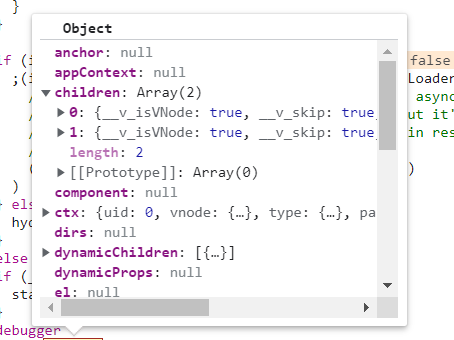
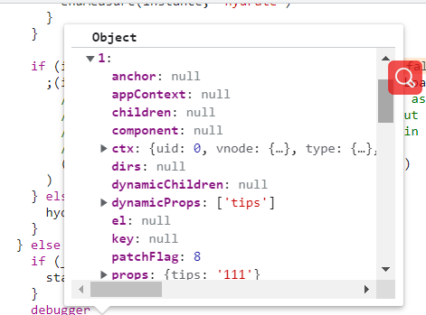

# props解读

1. 执行mount(packages\runtime-core\src\apiCreateApp.ts)->render(packages\runtime-core\src\renderer.ts)->patch

- 执行到`mountComponent`函数中的packages\runtime-core\src\renderer.ts
  中的`setupComponent(instance)`packages\runtime-core\src\component.ts

- `setupComponent` 函数主要初始化props，slost, setup,生成render函数

```js
(function anonymous(
) {
const _Vue = Vue
const { createVNode: _createVNode, createElementVNode: _createElementVNode } = _Vue

const _hoisted_1 = /*#__PURE__*/_createElementVNode("div", null, "txt", -1 /* HOISTED */)
const _hoisted_2 = ["onClick"]

return function render(_ctx, _cache) {
  with (_ctx) {
    const { createElementVNode: _createElementVNode, resolveComponent: _resolveComponent, createVNode: _createVNode, Fragment: _Fragment, openBlock: _openBlock, createElementBlock: _createElementBlock } = _Vue

    const _component_test = _resolveComponent("test")

    return (_openBlock(), _createElementBlock(_Fragment, null, [
      _hoisted_1,
      _createElementVNode("button", { onClick: show }, "显示", 8 /* PROPS */, _hoisted_2),
      _createVNode(_component_test, { tips: txt }, null, 8 /* PROPS */, ["tips"])
    ], 64 /* STABLE_FRAGMENT */))
  }
}
})
```


2. 得到render函数之后，执行`setupRenderEffect`packages\runtime-core\src\renderer.ts

- setupRenderEffect 函数执行render，生成vnode, 生成vnode的时候，props的tips已经有值了, 然后渲染

<p>
  
  
</p>

3. 在渲染vnode的过程中，发现有一个子组件，于是乎，又开始执行patch方法
  
3-1. 再次执行到`setupComponent`函数，
 执行`initProps(instance, props, isStateful, isSSR)`packages\runtime-core\src\componentProps.ts

- dev模式下校验props
```js
if (__DEV__) {
  validateProps(rawProps || {}, props, instance)
}
```

- 把props赋值赋值给instance
```js
if (isStateful) {
    // stateful
    instance.props = isSSR ? props : shallowReactive(props)
  }
```
- shallowReactive 是对props定义Proxy特性

```js
export function shallowReactive<T extends object>(
  target: T
): ShallowReactive<T> {
  return createReactiveObject(
    target,
    false,
    shallowReactiveHandlers,
    shallowCollectionHandlers,
    shallowReactiveMap
  )
}
```

4. 生成组件的render函数

```js
(function anonymous(
) {
const _Vue = Vue
const { createElementVNode: _createElementVNode, createTextVNode: _createTextVNode } = _Vue

const _hoisted_1 = ["onClick"]

return function render(_ctx, _cache) {
  with (_ctx) {
    const { createElementVNode: _createElementVNode, toDisplayString: _toDisplayString, createTextVNode: _createTextVNode, openBlock: _openBlock, createElementBlock: _createElementBlock } = _Vue

    return (_openBlock(), _createElementBlock("div", null, [
      _createElementVNode("h1", { onClick: changeHanle }, "11", 8 /* PROPS */, _hoisted_1),
      _createTextVNode(" " + _toDisplayString(tips), 1 /* TEXT */)
    ]))
  }
}
})
```

5. 执行render函数生成vnode `const subTree = (instance.subTree = renderComponentRoot(instance))`
packages\runtime-core\src\renderer.ts

- 在生成vnode的时候，取值是`tips`，因此会触发`RuntimeCompiledPublicInstanceProxyHandlers`函数的get操作符packages\runtime-core\src\componentPublicInstance.ts

```js
export const RuntimeCompiledPublicInstanceProxyHandlers = /*#__PURE__*/ extend(
  {},
  PublicInstanceProxyHandlers,
  {
    get(target: ComponentRenderContext, key: string) {
      // fast path for unscopables when using `with` block
      if ((key as any) === Symbol.unscopables) {
        return
      }

      return PublicInstanceProxyHandlers.get!(target, key, target)
    },
    has(_: ComponentRenderContext, key: string) {
      const has = key[0] !== '_' && !isGloballyWhitelisted(key)
      if (__DEV__ && !has && PublicInstanceProxyHandlers.has!(_, key)) {
        warn(
          `Property ${JSON.stringify(
            key
          )} should not start with _ which is a reserved prefix for Vue internals.`
        )
      }
      return has
    }
  }
)
```

- 接着执行`PublicInstanceProxyHandlers.get!(target, key, target)`

取值中符合条件,因此把值return出去
```js
else if (
// only cache other properties when instance has declared (thus stable)
// props
(normalizedProps = instance.propsOptions[0]) &&
hasOwn(normalizedProps, key)
) {
accessCache![key] = AccessTypes.PROPS
return props![key]
}
```

6. vnode已经把把`tips`的值显示, 接着就是把vnode渲染成正式DOM了

### props的值为什么不可以设置？

子组件设置props的值得时候，会触发PublicInstanceProxyHandlers.set操作符packages\runtime-core\src\componentPublicInstance.ts

执行判断
```js
 else if (hasOwn(instance.props, key)) {
    __DEV__ && warn(`Attempting to mutate prop "${key}". Props are readonly.`)
    return false
}
```
设置的值会被拦截掉，并且在dev模式下，会声称一个警告，production模式下没有任何反应

如果想修改的话，可以通过`this._.props`去修改,但是父级的数据不会变，
主要是在子组件初始化的时候，执行`instance.props = isSSR ? props : shallowReactive(props)`

props有了Proxy的特性，有get，和set函数的能力
### 总结
父级render生成vnode的时候，把props参数的值，接着执行vnode渲染成正式dom
遇到子组件的时候，执行组件的初始化操作，生成render函数。接着开始生成vnode
这时候，通过操作符`RuntimeCompiledPublicInstanceProxyHandlers`,拿到props的值
生成vnode，如何继续渲染成正式的dom


### 相关代码

```html
<!DOCTYPE html>
<html lang="en">
<head>
    <meta charset="UTF-8">
    <meta http-equiv="X-UA-Compatible" content="IE=edge">
    <meta name="viewport" content="width=device-width, initial-scale=1.0">
    <title>Document</title>
    <script src="../../dist/vue.global.js"></script>
</head>
<body>
    <div id="app">
        <div>txt</div>
        <button @click="show">显示</button>
        <test :tips="txt"></test>
    </div>
    </div>
    <script>
        var { createApp  } = Vue;

        var app = createApp({
            data() {
                return {
                    txt: '111'
                }
            },
            methods: {
                show() {
                    console.log(this.txt)
                }
            }
        })

        app.component('test', {
            props: {
                tips: {
                    type: String
                }
            },
            template: `
                <div>
                   <h1 @click="changeHanle">11</h1>
                   {{ tips }}
                </div>
            `,
            mounted() {
                console.log(this._.props)
            },
            methods: {
                changeHanle() {
                    this._.props.tips = '222'
                }
            }
        })

        app.mount('#app')
    </script>
</body>
</html>
```