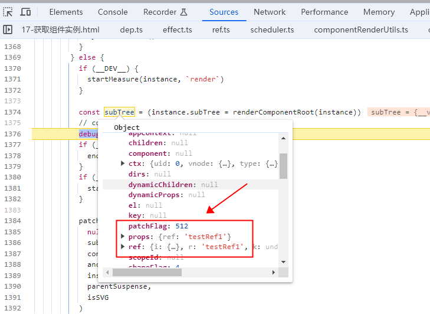
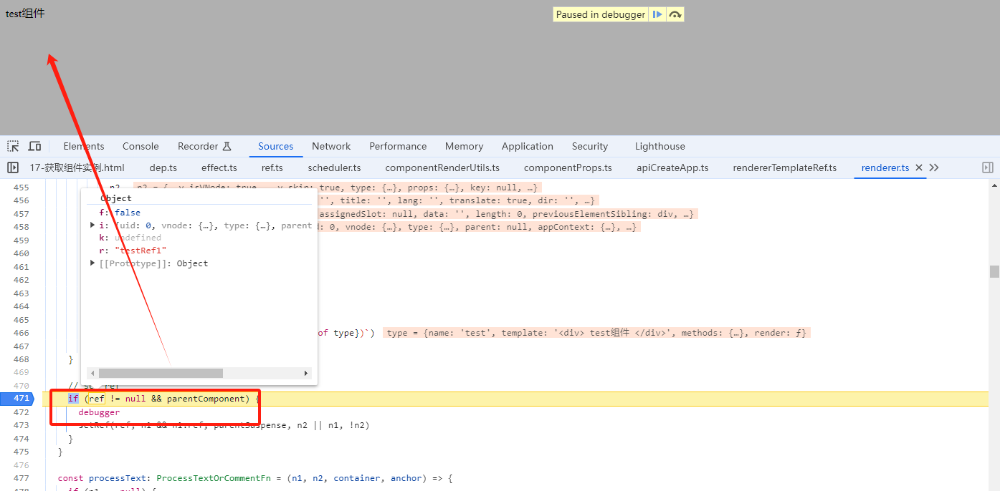
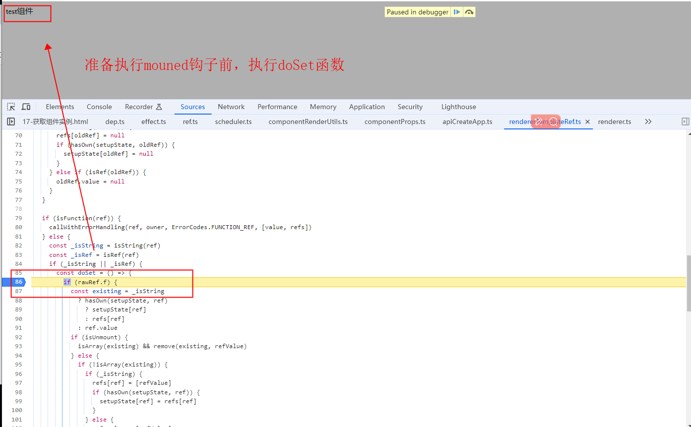

# $refs 获取组件实例解读

> 下列在 compostion api 中使用不同的 ref api定义变量去获取子组件的实例，会出现什么效果？

```vue
<script setup>
import test from "./test.vue";
const { ref, onMounted } = Vue;
const testRef1 = ref();
const testRef2 = ref("testRef2");
const testRef3 = ref("testRef3Value");
const testRef3Value = ref()
const testRef4 = ref(null);
const testRef5 = ref(null);

onMounted(() => {
    console.log("testRef1", testRef1.value);
    console.log("testRef2", testRef2.value);
    console.log("testRef3", testRef3.value);
    console.log("testRef3Value", testRef3Value.value);
    console.log("testRef4", testRef4.value);
    console.log("testRef5", testRef5.value);
});
</script>
<template>
    <div>
        <test ref="testRef1"></test>
        <test :ref="testRef2"></test>
        <test :ref="testRef3"></test>
        <test ref="testRef4"></test>
        <test :ref="testRef5"></test>
    </div>
</template>
```

## 答案

- `console.log("testRef1", testRef1.value)` 有效

- `console.log("testRef2", testRef2.value)` 有效

- `console.log("testRef3", testRef3.value)` 无效

1. 因为testRef3的值为`"testRef3Value"`，在渲染成为vnode的时候，实际上是`:ref="testRef3"`变成了`ref="testRef3Value"`

2. 因此在设置refs的时候，赋值给了在setup定义的`const testRef3Value = ref()`变量

3. `<test :ref="xxx"></test>`，最终中的ref是动态的

- `console.log("testRef3Value", testRef3Value.value)` 有效

- `console.log("testRef4", testRef4.value)` 有效

- `console.log("testRef5", testRef5.value)` 无效

## 源码解读

1. `执行app.mount('#app')`在`setupRenderEffect`(packages\runtime-core\src\renderer.ts)实现render函数生成vnode
可以看到`props和ref`是由值的
<p>
  
</p>

2. 接着就走vnode渲染成真实DOM流程，`patch`(packages\runtime-core\src\renderer.ts)函数开始
```javascript
patch(
    null,
    subTree,
    container,
    anchor,
    instance,
    parentSuspense,
    isSVG
)
```

3. 子组件渲染成功之后，紧接着执行`setRef函数`(packages\runtime-core\src\renderer.ts)
```javascript
if (ref != null && parentComponent) {
      setRef(ref, n1 && n1.ref, parentSuspense, n2 || n1, !n2)
}
```
<p>
  
</p>

3-1. `setRef函数`(packages\runtime-core\src\rendererTemplateRef.ts)中

- 获取当前设置`ref属性`的实例

- 获取父级实例`const { i: owner, r: ref } = rawRef`, 其中`owner`变量最为重要

  `setupState`变量 就是自己定义的`const testRef1 = ref()`变量，后面会把实例赋值到这个变量里面
  

```js
export function setRef(
  rawRef: VNodeNormalizedRef,
  oldRawRef: VNodeNormalizedRef | null,
  parentSuspense: SuspenseBoundary | null,
  vnode: VNode,
  isUnmount = false
) {
    const refValue =
        vnode.shapeFlag & ShapeFlags.STATEFUL_COMPONENT
        ? getExposeProxy(vnode.component!) || vnode.component!.proxy
        : vnode.el
    const value = isUnmount ? null : refValue

  const { i: owner, r: ref } = rawRef
  if (__DEV__ && !owner) {
    warn(
      `Missing ref owner context. ref cannot be used on hoisted vnodes. ` +
        `A vnode with ref must be created inside the render function.`
    )
    return
  }
  const oldRef = oldRawRef && (oldRawRef as VNodeNormalizedRefAtom).r
  const refs = owner.refs === EMPTY_OBJ ? (owner.refs = {}) : owner.refs
  const setupState = owner.setupState
}
```

3-2. 接着判断用户定义的ref属性类型，是否是函数，字符串类型

- 定义一个`doSet`函数，该函数就是把ref赋值当前实例的核心函数
  把该函数是赋值给一个异步执行的函数`queuePostRenderEffect(doSet, parentSuspense)`

- 当组件渲染完毕，准备执行`mounted`钩子`前`, 执行`doSet`函数

<p>
  
</p>

3-3. 在`doSet`函数判断ref的变量为字符串

- 这时候就父组件的refs属性赋值，ref为定义的key名称

- 判断定义的 `testRef1`和子组件属性`ref="testRef1"`是否有关联
`const testRef1 = ref()`
`<test ref="testRef1"></test>`
如果有关联关系，赋值`setupState[ref] = value`

3-4. 如果判断是一个数组`rawRef.f`属性为true，
对`refs[ref] = [refValue]`进行数组的操作

```js
else if (_isString) {
    refs[ref] = value
    if (hasOwn(setupState, ref)) {
      setupState[ref] = value
    }
}
```

3-4. `doSet`函数
```js
if (isFunction(ref)) {
    callWithErrorHandling(ref, owner, ErrorCodes.FUNCTION_REF, [value, refs])
  } else {
    const _isString = isString(ref)
    const _isRef = isRef(ref)
    if (_isString || _isRef) {
      const doSet = () => {
        if (rawRef.f) {
          const existing = _isString
            ? hasOwn(setupState, ref)
              ? setupState[ref]
              : refs[ref]
            : ref.value
          if (isUnmount) {
            isArray(existing) && remove(existing, refValue)
          } else {
            if (!isArray(existing)) {
              if (_isString) {
                refs[ref] = [refValue]
                if (hasOwn(setupState, ref)) {
                  setupState[ref] = refs[ref]
                }
              } else {
                ref.value = [refValue]
                if (rawRef.k) refs[rawRef.k] = ref.value
              }
            } else if (!existing.includes(refValue)) {
              existing.push(refValue)
            }
          }
        } else if (_isString) {
          refs[ref] = value
          if (hasOwn(setupState, ref)) {
            setupState[ref] = value
          }
        } else if (_isRef) {
          ref.value = value
          if (rawRef.k) refs[rawRef.k] = value
        } else if (__DEV__) {
          warn('Invalid template ref type:', ref, `(${typeof ref})`)
        }
      }
      if (value) {
        // #1789: for non-null values, set them after render
        // null values means this is unmount and it should not overwrite another
        // ref with the same key
        ;(doSet as SchedulerJob).id = -1
        queuePostRenderEffect(doSet, parentSuspense)
      } else {
        doSet()
      }
    } else if (__DEV__) {
      warn('Invalid template ref type:', ref, `(${typeof ref})`)
    }
  }
```
## 赋值给父组件的refs，可以通过$refs访问

1. 执行组件初始化的`mountComponent函数`时候，会执行`createComponentInstance函数`（packages\runtime-core\src\component.ts） 如果是devepment模式，就是执行`createDevRenderContext` (packages\runtime-core\src\componentPublicInstance.ts)，
定义$el,$attrs,$props等

1-1. 创建的$变量保存的instance.ctx中
```js
if (__DEV__) {
  instance.ctx = createDevRenderContext(instance)
} else {
instance.ctx = { _: instance }
}

export const publicPropertiesMap: PublicPropertiesMap =
  // Move PURE marker to new line to workaround compiler discarding it
  // due to type annotation
  /*#__PURE__*/ extend(Object.create(null), {
    $: i => i,
    $el: i => i.vnode.el,
    $data: i => i.data,
    $props: i => (__DEV__ ? shallowReadonly(i.props) : i.props),
    $attrs: i => (__DEV__ ? shallowReadonly(i.attrs) : i.attrs),
    $slots: i => (__DEV__ ? shallowReadonly(i.slots) : i.slots),
    $refs: i => (__DEV__ ? shallowReadonly(i.refs) : i.refs),
    $parent: i => getPublicInstance(i.parent),
    $root: i => getPublicInstance(i.root),
    $emit: i => i.emit,
    $options: i => (__FEATURE_OPTIONS_API__ ? resolveMergedOptions(i) : i.type),
    $forceUpdate: i => i.f || (i.f = () => queueJob(i.update)),
    $nextTick: i => i.n || (i.n = nextTick.bind(i.proxy!)),
    $watch: i => (__FEATURE_OPTIONS_API__ ? instanceWatch.bind(i) : NOOP)
  } as PublicPropertiesMap)

```

## 总结
- 在html模板定义了ref属性的组件如：`<test ref="testRef1"></test>`，会在该组件渲染完毕之后，mounted钩子前，执行`setRef`，给父组件设置`refs属性`.
通过$refs可以访问到


- 在定义动态的:ref 如：`<test :ref="testRef1"></test>`，这种写法一般不推荐，如果想要获取到实例，必须要`const testRef1 = ref("testRef1")`

或者`const testRef1 = ref("testRef1Value")；const testRef1Value = ref()`,用ref api定义`testRef1Value`去承接组件实例的赋值

既变量名和值要一样。因为`setRef函数`里面，赋值组件实例执行了`setupState[ref] = value`

- 定义静态ref，如`<test ref="testRef1"></test>`，在composition api中定义任何值都没有问题 `const testRef1 = ref("任何值")`

因为`setupState`,是对`testRef1`字符串操作的，它会执行`testRef1.value=xxx`


## 相关代码

```html
<!DOCTYPE html>
<html lang="en">
    <head>
        <meta charset="UTF-8" />
        <meta name="viewport" content="width=device-width, initial-scale=1.0" />
        <title>Document</title>
        <script src="../../dist/vue.global.js"></script>
    </head>
    <body>
        <div id="app">
            <test ref="testRef1"></test>
            <test :ref="testRef2"></test>

            <test ref="testRef3"></test>
            <test ref="testRef4"></test>
            <test :ref="testRef5"></test>
        </div>
        <script>
            const { createApp, onMounted, ref } = Vue;
            var app = createApp({
                setup() {
                    const testRef1 = ref();
                    const testRef2 = ref("testRef2");
                    const testRef3 = ref("testRef3Value");
                    const testRef4 = ref(null);
                    const testRef5 = ref(null);
                    onMounted(() => {});
                    return {
                        testRef1,
                        testRef2,
                        testRef3,
                        testRef4,
                        testRef5
                    };
                },
            });
            app.component("test", {
                name: "test",
                template: `<div> test组件 </div>`,
                methods: {
                    show() {
                        alert(1);
                    },
                },
            });

            app.mount("#app");
        </script>
    </body>
</html>
```
