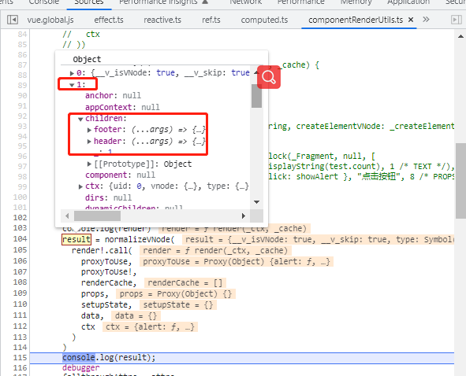
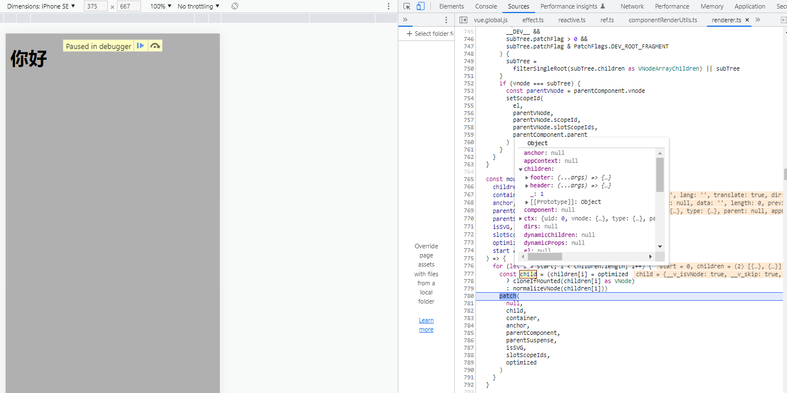
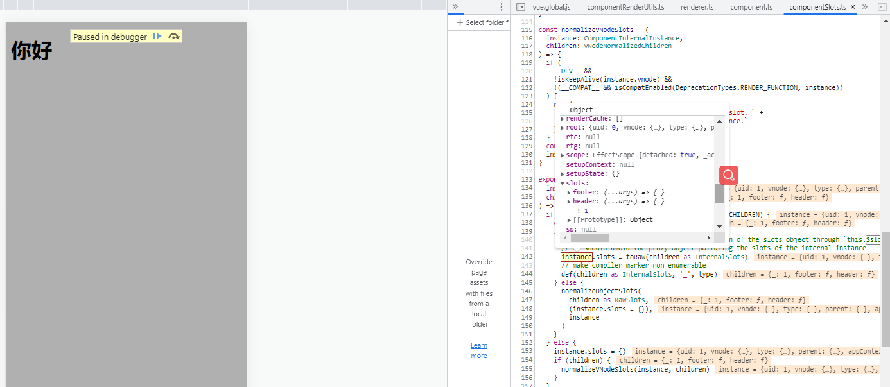
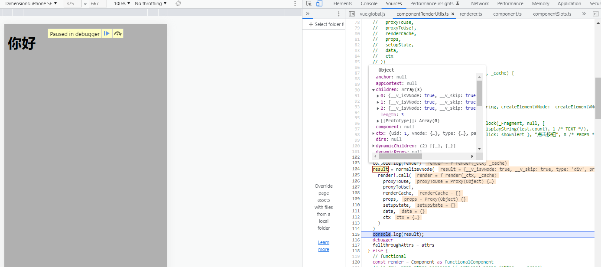
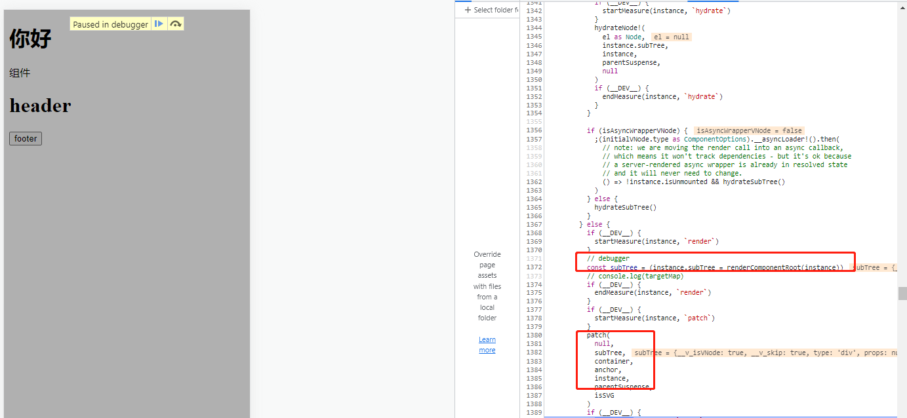

# slot插槽解读

## 相关代码
```html
<!DOCTYPE html>
<html lang="en">
<head>
    <meta charset="UTF-8">
    <meta http-equiv="X-UA-Compatible" content="IE=edge">
    <meta name="viewport" content="width=device-width, initial-scale=1.0">
    <title>Document</title>
    <script src="../../dist/vue.global.js"></script>
</head>
<body>
    <div id="app">
        <h1>你好</h1>
        <test>
            <template v-slot:footer>
                <button @click="alert">footer</button>
            </template>

            <template v-slot:header>
                <h1>header</h1>
            </template>
        </test>
    </div>
    <script>
        var { createApp  } = Vue;

        var app = createApp({
            methods: {
                alert() {
                    alert(1)
                }
            },
            mounted() {
                console.log(this.$slots)
            }
        })

        app.component('test', {
            template: `
                <div>
                    <main>组件</main>
                    <header>
                        <slot name="header"></slot>
                    </header>
                    <footer>
                       <slot name="footer"></slot>
                    </footer>
                </div>
            `,
            mounted() {
                console.log(this.$slots.footer())
            }
        })

        app.mount('#app')
    </script>
</body>
</html>
```

1. 编译父html模板，得到render函数

- render函数中就包含了footer函数，和header函数，这两个函数如果执行是可以返回vnode

```html
<div id="app">
    <h1>你好</h1>
    <test>
        <template v-slot:footer>
            <button @click="alert">footer</button>
        </template>

        <template v-slot:header>
            <h1>header</h1>
        </template>
    </test>
</div>
```

```js
(function anonymous(
) {
const _Vue = Vue
const { createVNode: _createVNode, createElementVNode: _createElementVNode } = _Vue

const _hoisted_1 = /*#__PURE__*/_createElementVNode("h1", null, "你好", -1 /* HOISTED */)
const _hoisted_2 = ["onClick"]
const _hoisted_3 = /*#__PURE__*/_createElementVNode("h1", null, "header", -1 /* HOISTED */)

return function render(_ctx, _cache) {
  with (_ctx) {
    const { createElementVNode: _createElementVNode, resolveComponent: _resolveComponent, withCtx: _withCtx, createVNode: _createVNode, Fragment: _Fragment, openBlock: _openBlock, createElementBlock: _createElementBlock } = _Vue

    const _component_test = _resolveComponent("test")

    return (_openBlock(), _createElementBlock(_Fragment, null, [
      _hoisted_1,
      _createVNode(_component_test, null, {
        footer: _withCtx(() => [
          _createElementVNode("button", { onClick: alert }, "footer", 8 /* PROPS */, _hoisted_2)
        ]),
        header: _withCtx(() => [
          _hoisted_3
        ]),
        _: 1 /* STABLE */
      })
    ], 64 /* STABLE_FRAGMENT */))
  }
}
})
```

2. 得到父render函数之后，生成vnode, 第二个children是组件test的, 它的children是一个对象，不再是数组了

<p>
  
</p>

3. 拿到vnode之后，开始执行patch，先渲染第一个children，渲染完之后，紧接着就开始渲染第二个childen，既`test组件`的内容

<p>
  
</p>

4. 渲染`test组件`, 相当于中一次初始化流程patch->proessComponet->mountCompoent->setupComponent

- setupCompoent函数里面执行`initSlots(instance, children)`packages\runtime-core\src\component.ts
  会把footer，header函数复制给solts对象上面

<p>
  
</p>


5. 执行`setupRenderEffect`packages\runtime-core\src\renderer.ts, 把test组件的html模板编译成render
- `_renderSlot($slots, "header")` , `_renderSlot($slots, "footer")`这两个表示test组件插槽的名称

```html
<div>
    <main>组件</main>
    <header>
        <slot name="header"></slot>
    </header>
    <footer>
        <slot name="footer"></slot>
    </footer>
</div>
```

```js
(function anonymous(
) {
const _Vue = Vue
const { createElementVNode: _createElementVNode } = _Vue

const _hoisted_1 = /*#__PURE__*/_createElementVNode("main", null, "组件", -1 /* HOISTED */)

return function render(_ctx, _cache) {
  with (_ctx) {
    const { createElementVNode: _createElementVNode, renderSlot: _renderSlot, openBlock: _openBlock, createElementBlock: _createElementBlock } = _Vue

    return (_openBlock(), _createElementBlock("div", null, [
      _hoisted_1,
      _createElementVNode("header", null, [
        _renderSlot($slots, "header")
      ]),
      _createElementVNode("footer", null, [
        _renderSlot($slots, "footer")
      ])
    ]))
  }
}
})
```


6. 执行render函数生成vnode，可以看到父组件使用的test组件生成了三个chidren

这三个children的内容实际上就是
```html
<div>
  <main>组件</main>
  <header><button @click="alert">footer</button></header>
  <footer><h1>header</h1></footer>
</div>
```

<p>
  
</p>


7. 生成vnoder之后，接着执行patch,把父组件用到的test组件，渲染生真实dom

<p>
  
</p>

## 使用
- 在optionsApi中可以通过`this.$slots`方法
- 在template可以通过`$slots`访问
- 在compositionApi中可以用`useSlots()`访问

```html
<script setup>
import { useSlots, useAttrs } from 'vue'

const slots = useSlots()
const attrs = useAttrs()
</script>
```


## 总结
Vue先把父组件的html模板编译生成render函数，组件和在组件里面使用的插槽，会做特殊处理。接着生成vnode。
父组件的vnode开始执行patch渲染，如果遇到children是普通元素，直接渲染成真实DOM,遇到组件的时候，又会执行一些的初始化，
- 初始化组件的data, props, 处理template，把父组件的插槽函数赋值给子组件实例的$slots中， 生成render函数
- 类似于vue的初始化流程

执行组件的render函数，在生成vnode的时候，执行`_renderSlot($slots, "header")`,其实就是执行父组件的$slots.heander生成vnode
拿到vnode，接着执行patch，把子组件渲染成真实DOM