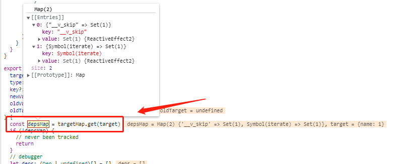

# watch案例

## 案例一：最常见用法

```html
<!DOCTYPE html>
<html lang="en">
<head>
  <meta charset="UTF-8">
  <meta name="viewport" content="width=device-width, initial-scale=1.0">
  <title>Document</title>
  <script src="../../dist/vue.global.js"></script>
</head>
<body>
  <div id="app">
  </div>
  <script>  
    var { createApp, ref, watch  } = Vue;

    var app = createApp({
        setup() {
            var test = ref({});


            setTimeout(() => {
              test.value.name = 1
            }, 3000)

            watch(test.value, () => {
              console.log(test.value)
            })

            return {
                test,
            }
        }
    })
    app.mount('#app')

  </script>
  <script>
  </script>
</body>
</html>
```
> watch做了什么, 如何触发回调函数的执行？

1：test变量定义ref类型的值，通过value取值，赋值; `packages\reactivity\src\ref.ts`

2: 执行watch方法`packages\runtime-core\src\apiWatch.ts`, 执行test.value和传入回调函数

2-1: test.value会触发`get value`方法， 执行`trackRefValue(this)` 该方法也是一个收集依赖方法
     确保修改value的值的时候，可以触发依赖的执行
```js
export function trackRefValue(ref: RefBase<any>) {
  if (shouldTrack && activeEffect) {
    ref = toRaw(ref)
    if (__DEV__) {
      trackEffects(ref.dep || (ref.dep = createDep()), {
        target: ref,
        type: TrackOpTypes.GET,
        key: 'value'
      })
    } else {
      trackEffects(ref.dep || (ref.dep = createDep()))
    }
  }
}
```

应为activeEffect为空，所有不执行依赖的收集

3：执行`return doWatch(source as any, cb, options)` 

   - 由于test.value是一个reactive对象，所以赋值给getter，并且把deep设置为true

   - 由于deep为true，也就是深度监听，所以用traverse对getter再做一层封装`packages\runtime-core\src\apiWatch.ts`
  
```js
else if (isReactive(source)) {
    getter = () => source
    deep = true
} 

// getter();
if (cb && deep) {
  const baseGetter = getter
  getter = () => traverse(baseGetter())
}
```

4: 定义依赖函数， `const effect = new ReactiveEffect(getter, scheduler)`

  - `scheduler = () => queueJob(job)`是异步执行的，为了都次触发set，只会执行一次

5：接着就执行 `oldValue = effect.run()`

```js
run() {
    // debugger
    if (!this.active) {
      return this.fn()
    }
    let parent: ReactiveEffect | undefined = activeEffect
    let lastShouldTrack = shouldTrack
    while (parent) {
      if (parent === this) {
        return
      }
      parent = parent.parent
    }
    try {
      this.parent = activeEffect
      activeEffect = this
      shouldTrack = true

      trackOpBit = 1 << ++effectTrackDepth

      if (effectTrackDepth <= maxMarkerBits) {
        initDepMarkers(this)
      } else {
        cleanupEffect(this)
      }
      return this.fn()
    } finally {
      if (effectTrackDepth <= maxMarkerBits) {
        finalizeDepMarkers(this)
      }

      trackOpBit = 1 << --effectTrackDepth

      activeEffect = this.parent
      shouldTrack = lastShouldTrack
      this.parent = undefined

      if (this.deferStop) {
        this.stop()
      }
    }
}
```
- 把当前的依赖，赋值到全局依赖中, 开始执行`this.fn()`, 该函数就是getter函数

```js
this.parent = activeEffect
activeEffect = this
shouldTrack = true
```

5-1：由于有traverse函数，所以就会遍历test.value对象

执行判断
```js
if (!isObject(value) || (value as any)[ReactiveFlags.SKIP]) {
    return value
}
```
- 触发get操作符`packages\reactivity\src\baseHandlers.ts`, test.value.__v_skip 收集到activeEffect

- 举行递归遍历, 这个用于触发了in操作符，所以执行了ownKeys操作符
```js
for (const key in value) {
  traverse((value as any)[key], seen)
}


function ownKeys(target: object): (string | symbol)[] {
  track(target, TrackOpTypes.ITERATE, isArray(target) ? 'length' : ITERATE_KEY)
  return Reflect.ownKeys(target)
}
```

- test.value.Symbol(iterate) 收集到activeEffect ，这个Symbol(iterate)属性用重要，后面新加的键值会用到这个


6：执行到setTimeout，给空对象赋值，触发ref对象中的`get value`方法, 执行依赖收集`trackRefValue(this)` 
  因为`activeEffect`为空，所以不执行
6-1：接着就开始赋值了`test.value.name = 1`, 会先触发`packages\reactivity\src\baseHandlers.ts`的set操作符

- 因为是新增了一个name属性，所有执行`trigger(target, TriggerOpTypes.ADD, key, value)`

- 接着就开始执行寻找test.value的依赖，发现有依赖

<p>
  
</p>

- 获取name的依赖，发现没有, 因为是新增的属性，所有depsMap对象肯定是不存在name键值依赖的
  所有就判断type类型是新增属性`TriggerOpTypes.ADD`
  
```js
if (key !== void 0) {
  deps.push(depsMap.get(key))
}

switch (type) {
  case TriggerOpTypes.ADD:
    if (!isArray(target)) {
      deps.push(depsMap.get(ITERATE_KEY))
      if (isMap(target)) {
        deps.push(depsMap.get(MAP_KEY_ITERATE_KEY))
      }
    } else if (isIntegerKey(key)) {
      // new index added to array -> length changes
      deps.push(depsMap.get('length'))
    }
    break
  case TriggerOpTypes.DELETE:
    if (!isArray(target)) {
      deps.push(depsMap.get(ITERATE_KEY))
      if (isMap(target)) {
        deps.push(depsMap.get(MAP_KEY_ITERATE_KEY))
      }
    }
    break
  case TriggerOpTypes.SET:
    if (isMap(target)) {
      deps.push(depsMap.get(ITERATE_KEY))
    }
    break
}
```

- 把test.value的值依赖找出来,插入到`deps.push(depsMap.get(ITERATE_KEY))`
  
`ITERATE_KEY` 这个是执行`traverse`中的`for in` 语句,触发了ownKeys函数产生的

```js
// packages\reactivity\src\baseHandlers.ts
function ownKeys(target: object): (string | symbol)[] {
  track(target, TrackOpTypes.ITERATE, isArray(target) ? 'length' : ITERATE_KEY)
  return Reflect.ownKeys(target)
}
```

7: 触发name的设置，就找到了test.value收集的`activeEffect`依赖，插入数组deps中
```js
deps.push(depsMap.get(ITERATE_KEY))
```

8: 开始遍历deps数组，触发依赖的执行, 最终执行回调函数
```js
function triggerEffect(
  effect: ReactiveEffect,
  debuggerEventExtraInfo?: DebuggerEventExtraInfo
) {
  if (effect !== activeEffect || effect.allowRecurse) {
    if (__DEV__ && effect.onTrigger) {
      effect.onTrigger(extend({ effect }, debuggerEventExtraInfo))
    }
    if (effect.scheduler) {
      effect.scheduler()
    } else {
      effect.run()
    }
  }
}

// 执行回调
callWithAsyncErrorHandling(cb, instance, ErrorCodes.WATCH_CALLBACK, [
  newValue,
  // pass undefined as the old value when it's changed for the first time
  oldValue === INITIAL_WATCHER_VALUE
    ? undefined
    : isMultiSource && oldValue[0] === INITIAL_WATCHER_VALUE
    ? []
    : oldValue,
  onCleanup
])
```

## 案例一总结
这些监听响应式值的写法，会自动帮你把deep设置为true, 也就是深度监听；
会执行`traverse(baseGetter())`, 深度遍历，触发属性的get，收集依赖
在新增键值的时候，会拿父级的依赖`depsMap.get(ITERATE_KEY)`, 里面所有的依赖
执行依赖的更新，从而执行watch的回调函数


## 案例二：watch不生效的场景

```html
<!DOCTYPE html>
<html lang="en">
<head>
  <meta charset="UTF-8">
  <meta name="viewport" content="width=device-width, initial-scale=1.0">
  <title>Document</title>
  <script src="../../dist/vue.global.js"></script>
</head>
<body>
  <div id="app">
  </div>
  <script>  
    var { createApp, ref, watch, onMounted  } = Vue;

    var app = createApp({
        setup() {
            var test = ref({});

            onMounted(() => {
              test.value = { name: 1 }
            })

            setInterval(() => {
              test.value.name++
            }, 3000)

            watch(test.value, () => {
              debugger
            })

            return {
                test,
            }
        }
    })
    app.mount('#app')

  </script>
  <script>
  </script>
</body>
</html>
```

> 上面的代码执行完之后，会发现不执行watch里面的回调函数了，这是为什么呢？

1：定义ref类型的响应式`var test = ref({})`, 如何开始执行`watch(test.value, cb)`函数

2: 这时候触发了test.value，也就是ref中的`get value()`方法，该方法会执行`trackRefValue(this)`

```js
export function trackRefValue(ref: RefBase<any>) {
  if (shouldTrack && activeEffect) {
    ref = toRaw(ref)
    if (__DEV__) {
      trackEffects(ref.dep || (ref.dep = createDep()), {
        target: ref,
        type: TrackOpTypes.GET,
        key: 'value'
      })
    } else {
      trackEffects(ref.dep || (ref.dep = createDep()))
    }
  }
}
```

- 就是为当前ref实例，收集依赖，但是发现`shouldTrack`为false, `activeEffect`为undefined,所以不执行后面的逻辑

3：触发ref的`get value()` 方法之后,开始执行watch函数了

3-1: test.value是响应式属性，所以`isReactive(source)`为true， deep为true
    如何包裹一层函数
```js
if (cb && deep) {
  const baseGetter = getter
  getter = () => traverse(baseGetter())
}
```

4: 然后实例化构造函数`const effect = new ReactiveEffect(getter, scheduler)`， 执行`effect.run()`

执行`getter = () => traverse(baseGetter())` 为test.value里面的属性搜集`ReactiveEffect`依赖

5: onMounted之后，直接替换test.value的值，触发了`set value()`方法

5-1：对新设置的值，重新定义proxy响应式属性`toReactive(newVal)`

  并且触发`triggerRefValue(this, newVal)`, 触发依赖的执行

```js
set value(newVal) {
    const useDirectValue =
      this.__v_isShallow || isShallow(newVal) || isReadonly(newVal)

    newVal = useDirectValue ? newVal : toRaw(newVal)
    if (hasChanged(newVal, this._rawValue)) {
      this._rawValue = newVal
      this._value = useDirectValue ? newVal : toReactive(newVal)
      triggerRefValue(this, newVal)
    }
}
```

但是`get value()`的时候，没有收集到`ReactiveEffect`，所以执行`triggerRefValue(this, newVal)`
的时候，没有执行到watch的回调函数


6：后面执行setInterval对test.value进行赋值的时候，也没有更新watch的回调，因为`set value()`的时候
 重新执行了一次`toReactive(newVal)` 原来收集的已经失效了

### 7：解决方法
```js

// 方法一
watch(() => test.value, () => {
  debugger
}, { deep: true })

// 方法二
watch(test, () => {
  debugger
}, { deep: true })

```

这个写法，不会一开始就触发ref实例的`get value()`方法, 而是在创建
`const effect = new ReactiveEffect(getter, scheduler)` ，执行effect.run()
的时候，触发`get value()`方法，搜集依赖


7-1：当对test.value赋值的时候，触发`set value()`方法，就可以触发`triggerRefValue(this, newVal)`
执行依赖，从而可以再次对新的值，重新搜集依赖


## 案例二总结

普通的写法进行监听，对ref的值进行赋值，既：test.value = { name: 1 }，在`get vlaue()`的时候，没有收集
到watch的依赖，在触发`set value()`的时候，就没有再行watch了

而加了函数包裹test.value，在执行`effect.run()`的时候，才会触发ref的`get value()`, 从而可以执行t`rackRefValue(this)`收集到依赖
```js
watch(() => test.value, () => {
  debugger
}, { deep: true })

export function trackRefValue(ref: RefBase<any>) {
  if (shouldTrack && activeEffect) {
    ref = toRaw(ref)
    if (__DEV__) {
      trackEffects(ref.dep || (ref.dep = createDep()), {
        target: ref,
        type: TrackOpTypes.GET,
        key: 'value'
      })
    } else {
      trackEffects(ref.dep || (ref.dep = createDep()))
    }
  }
}
```
再触发`set value()`的时候，也就可以重新触发`effect.run()`了
