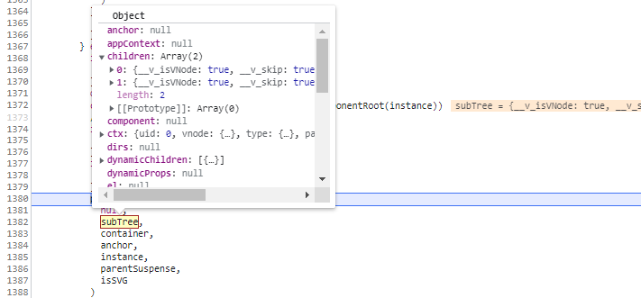
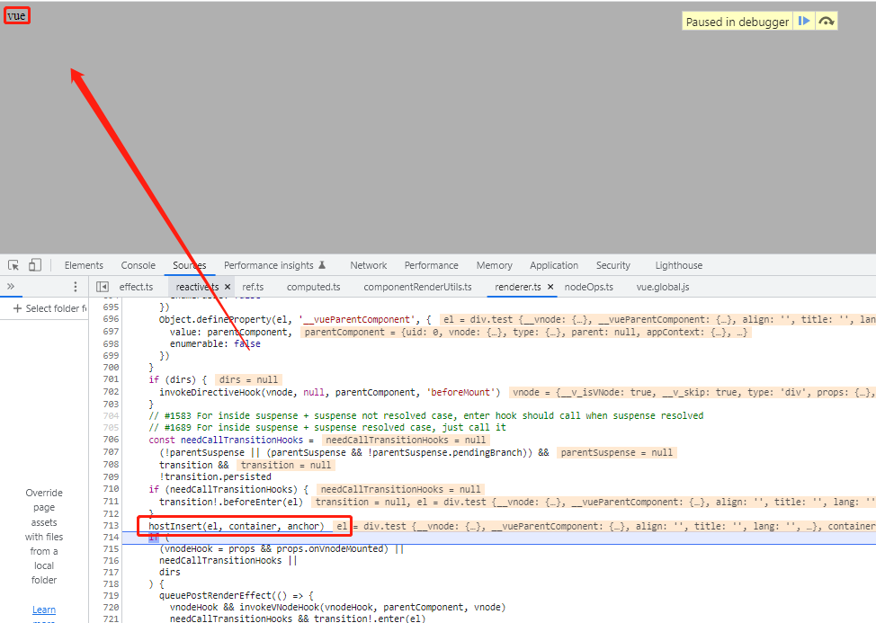

# vnode渲染真实dom

1. Vue执行完初始化，生成render函数之后，执行`setupRenderEffect`函数，封装`componentUpdateFn`函数(packages\runtime-core\src\renderer.ts)
作为一个渲染函数的`ReactiveEffect`实例

1-1. `componentUpdateFn`函数就是执行render函数生成vnode，变成把vnode渲染成真实DOM的最初始函数

1-2. 把生成的vnode，传入到patch，作为第二参数，开始渲染成真实DOM正式开始
```js
patch(
    null,
    subTree,
    container,
    anchor,
    instance,
    parentSuspense,
    isSVG
)
```

2：以下面代码为例，得到subTree是一个对象，type为`Symbol(Fragment)`,有children, dynamicChildren属性
<p>
  
</p>

2-1：传入到patch函数之后，vnode的type类型，为`Fragment`，执行`processFragment`
n1：null
n2: render函数生成vnode
container: id为app的html对象
anchor: null
parentComponent: vue的实例
isSVG：false
slotScopeIds: null
optimized: true
```js
processFragment(
    n1,
    n2,
    container,
    anchor,
    parentComponent,
    parentSuspense,
    isSVG,
    slotScopeIds,
    optimized
)
```

2-2. 因为n1是null,所以执行`mountChildren`，vnode的children作为第一参数，#app元素对象为第二参数
```js
if (n1 == null) {
    hostInsert(fragmentStartAnchor, container, anchor)
    hostInsert(fragmentEndAnchor, container, anchor)
    // a fragment can only have array children
    // since they are either generated by the compiler, or implicitly created
    // from arrays.
    mountChildren(
    n2.children as VNodeArrayChildren,
    container,
    fragmentEndAnchor,
    parentComponent,
    parentSuspense,
    isSVG,
    slotScopeIds,
    optimized
    )
}
```

2-3. `mountChildren`函数遍历vnode的children数组

- 拿到数组的第一个数组，传入patch作为第二参数，第一个参数为null

- 开始又一次执行patch函数
```js
const mountChildren: MountChildrenFn = (
    children,
    container,
    anchor,
    parentComponent,
    parentSuspense,
    isSVG,
    slotScopeIds,
    optimized,
    start = 0
  ) => {
    for (let i = start; i < children.length; i++) {
      const child = (children[i] = optimized
        ? cloneIfMounted(children[i] as VNode)
        : normalizeVNode(children[i]))
      patch(
        null,
        child,
        container,
        anchor,
        parentComponent,
        parentSuspense,
        isSVG,
        slotScopeIds,
        optimized
      )
    }
  }
```

2-4：获取type的类型为`div`，因此判断`shapeFlag`的类型为17，既为html元素类型
执行`processElement`函数
n1：null
n2: vnode.children第一个数组
container: id为app的html对象
anchor: null
parentComponent: vue的实例
isSVG：false
slotScopeIds: null
optimized: true
```js
if (shapeFlag & ShapeFlags.ELEMENT) {
    processElement(
    n1,
    n2,
    container,
    anchor,
    parentComponent,
    parentSuspense,
    isSVG,
    slotScopeIds,
    optimized
    )
}
```
2-5. 执行processElement函数，因为第一个n1参数为null，因此执行`mountElement`
```js
const processElement = (
    n1: VNode | null,
    n2: VNode,
    container: RendererElement,
    anchor: RendererNode | null,
    parentComponent: ComponentInternalInstance | null,
    parentSuspense: SuspenseBoundary | null,
    isSVG: boolean,
    slotScopeIds: string[] | null,
    optimized: boolean
) => {
    isSVG = isSVG || (n2.type as string) === 'svg'
    if (n1 == null) {
        mountElement(
        n2,
        container,
        anchor,
        parentComponent,
        parentSuspense,
        isSVG,
        slotScopeIds,
        optimized
        )
    } else {
        patchElement(
        n1,
        n2,
        parentComponent,
        parentSuspense,
        isSVG,
        slotScopeIds,
        optimized
        )
    }
}
```

5-7. `mountElement`首先根
- 据n2参数执行`hostCreateElement`函数创建一个html元素（packages\runtime-dom\src\nodeOps.ts）

- 判断n2的`shapeFlag`类型（packages\shared\src\shapeFlags.ts），如果是9，则为元素插入文本节点

- 如果n2的`shapeFlag`类型为17，执行`mountChildren`函数传入chidren数组


```js
el = vnode.el = hostCreateElement(
    vnode.type as string,
    isSVG,
    props && props.is,
    props
)

if (shapeFlag & ShapeFlags.TEXT_CHILDREN) {
      hostSetElementText(el, vnode.children as string)
    } else if (shapeFlag & ShapeFlags.ARRAY_CHILDREN) {
    mountChildren(
        vnode.children as VNodeArrayChildren,
        el,
        null,
        parentComponent,
        parentSuspense,
        isSVG && type !== 'foreignObject',
        slotScopeIds,
        optimized
    )
}
```

5-7-1. 如有props有值，如class, style等，给元素设置属性
```js
if (props) {
  for (const key in props) {
    if (key !== 'value' && !isReservedProp(key)) {
      hostPatchProp(
        el,
        key,
        null,
        props[key],
        isSVG,
        vnode.children as VNode[],
        parentComponent,
        parentSuspense,
        unmountChildren
      )
    }
  }
```

5-7-2. 执行`hostInsert(el, container, anchor)`既把创建的新元素对象，插入到`container`里面，

- `container` 可以理解为`#app`的元素对象

6. 这时候页面就可以显示内容了，手续的内容也是这样子逐渐展示
<p>
  
</p>

## 总结
通过递归遍历vnode来渲染dom
类似于：`patch`->`processFragment`->`mountChildren`(遍历children数组)->`patch`->`processElement`->`mountElement`->`mountChildren`->`patch`

递归执行，最终一步一步把vnode的内容渲染成真实DOM

## 相关代码
```html
<!DOCTYPE html>
<html lang="en">
<head>
  <meta charset="UTF-8">
  <meta name="viewport" content="width=device-width, initial-scale=1.0">
  <title>Document</title>
  <script src="../../dist/vue.global.js"></script>
</head>
<body>
  <div id="app">
    <div class="test" style="font-size: 14px;">
       <div>{{msg}}</div>
    </div>
    <div>stasut</div>
  </div>
  <script>  
    const { createApp } = Vue;
    
    var app = createApp({
      data() {
        return {
          msg: 'vue'
        }
      },
    })
    app.mount('#app')
  </script>
</body>
</html>
```