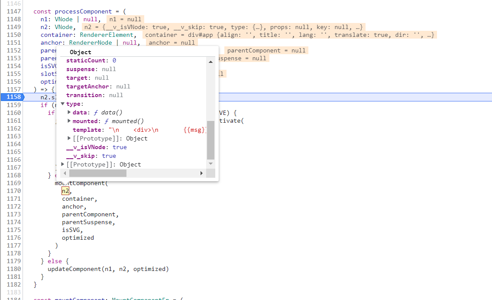

# 模板render函数的生成

1: 执行`createApp({xxx})` packages\runtime-dom\src\index.ts, 返回一个app对象

```js
const app = ensureRenderer().createApp(...args)
```
1-1: `ensureRedner()`实际是执行baseCreateRenderer函数packages\runtime-core\src\renderer.ts,
    初始化一系列渲染函数，这些渲染函数，是居于，原生Dom操作的封装packages\runtime-dom\src\nodeOps.ts

1-2：最终baseCreateRenderer函数返回一个object对象, 得到的createApp，就是 `createAppAPI(render, hydrate)`函数执行
的结果
```js
return {
    render,
    hydrate,
    createApp: createAppAPI(render, hydrate)
}
```
1-3：`createAppAPI`在packages\runtime-core\src\apiCreateApp.ts中，这个应用了`函数柯里化`， 接受`render`函数, 
  返回了一个名为`createApp`的新函数

1-3-1：`render函数`是函数初始化的开始packages\runtime-core\src\renderer.ts
```js
const render: RootRenderFunction = (vnode, container, isSVG) => {
    if (vnode == null) {
      if (container._vnode) {
        unmount(container._vnode, null, null, true)
      }
    } else {
      patch(container._vnode || null, vnode, container, null, null, null, isSVG)
    }
    flushPreFlushCbs()
    flushPostFlushCbs()
    container._vnode = vnode
  }
```

1-3-2: `createApp`的新函数，接受用户传入的参数，如：`{ data: {xxx}, mounte() {xxx}, methosd: {xxx} }`
  返回的对象有
  ```js
 const app: App = (context.app = {
      use(plugin: Plugin, ...options: any[]) {
        
      },

      mixin(mixin: ComponentOptions) {
        
      },

      component(name: string, component?: Component): any {
        
      },

      directive(name: string, directive?: Directive) {
       
      },

      mount(
        rootContainer: HostElement,
        isHydrate?: boolean,
        isSVG?: boolean
      ): any {
        if (!isMounted) {
          // #5571
          if (__DEV__ && (rootContainer as any).__vue_app__) {
            warn(
              `There is already an app instance mounted on the host container.\n` +
                ` If you want to mount another app on the same host container,` +
                ` you need to unmount the previous app by calling \`app.unmount()\` first.`
            )
          }
          // debugger
          const vnode = createVNode(
            rootComponent as ConcreteComponent,
            rootProps
          )
          // store app context on the root VNode.
          // this will be set on the root instance on initial mount.
          vnode.appContext = context

          // HMR root reload
          if (__DEV__) {
            context.reload = () => {
              render(cloneVNode(vnode), rootContainer, isSVG)
            }
          }

          if (isHydrate && hydrate) {
            hydrate(vnode as VNode<Node, Element>, rootContainer as any)
          } else {
            render(vnode, rootContainer, isSVG)
          }
          isMounted = true
          app._container = rootContainer
          // for devtools and telemetry
          ;(rootContainer as any).__vue_app__ = app

          if (__DEV__ || __FEATURE_PROD_DEVTOOLS__) {
            app._instance = vnode.component
            devtoolsInitApp(app, version)
          }

          return getExposeProxy(vnode.component!) || vnode.component!.proxy
        } else if (__DEV__) {
          warn(
            `App has already been mounted.\n` +
              `If you want to remount the same app, move your app creation logic ` +
              `into a factory function and create fresh app instances for each ` +
              `mount - e.g. \`const createMyApp = () => createApp(App)\``
          )
        }
      },

      unmount() {
        
      },

      provide(key, value) {
        
      }
    })

    return app
  ```

2: 接着执行`app.mount('#app')`,即执行`createApp`packages\runtime-dom\src\index.tsd的mount方法 和 `createAppAPI`packages\runtime-core\src\apiCreateApp.ts的mount方法

2-1：`createApp`packages\runtime-dom\src\index.tsd的mount方法，把dom的html内容赋值给`template`属性里面
```js
app.mount = (containerOrSelector: Element | ShadowRoot | string): any => {
    const container = normalizeContainer(containerOrSelector)
    if (!container) return

    const component = app._component
    if (!isFunction(component) && !component.render && !component.template) {
      // rendered by the server, the template shou
    }

    container.innerHTML = ''
    const proxy = mount(container, false, container instanceof SVGElement)
    return proxy
  }

  return app
})
```

2-2: 紧接着执行`createAppAPI`packages\runtime-core\src\apiCreateApp.ts的mount方法
主要执行`render(vnode, rootContainer, isSVG)`

这个render就是`baseCreateRenderer函数`的packages\runtime-core\src\renderer.ts->render方法

```js
const render: RootRenderFunction = (vnode, container, isSVG) => {
  if (vnode == null) {
    if (container._vnode) {
      unmount(container._vnode, null, null, true)
    }
  } else {
    patch(container._vnode || null, vnode, container, null, null, null, isSVG)
  }
  flushPreFlushCbs()
  flushPostFlushCbs()
  container._vnode = vnode
}
```
3：执行vnode不为空，执行`patch(container._vnode || null, vnode, container, null, null, null, isSVG)`

判断传入的`vnode`对象类型,传入的vnode对象shapeFlag为4，属于ShapeFlags.COMPONENT

执行`processComponent`函数

```js
else if (shapeFlag & ShapeFlags.COMPONENT) {
    processComponent(
      n1,
      n2,
      container,
      anchor,
      parentComponent,
      parentSuspense,
      isSVG,
      slotScopeIds,
      optimized
    )
} 


export const enum ShapeFlags {
  ELEMENT = 1,
  FUNCTIONAL_COMPONENT = 1 << 1,
  STATEFUL_COMPONENT = 1 << 2,
  TEXT_CHILDREN = 1 << 3,
  ARRAY_CHILDREN = 1 << 4,
  SLOTS_CHILDREN = 1 << 5,
  TELEPORT = 1 << 6,
  SUSPENSE = 1 << 7,
  COMPONENT_SHOULD_KEEP_ALIVE = 1 << 8,
  COMPONENT_KEPT_ALIVE = 1 << 9,
  COMPONENT = ShapeFlags.STATEFUL_COMPONENT | ShapeFlags.FUNCTIONAL_COMPONENT
}

```
4：引入传入的n1为空，n1为上一个vnode，这里第一次渲染，所以为空，n2为包含了type属性，其中`template`内容的，和我们写入的代码
<p>
  
</p>

所以执行

```js
mountComponent(
  n2,
  container,
  anchor,
  parentComponent,
  parentSuspense,
  isSVG,
  optimized
)
```

4-1：`mountComponent`函数中执行一个非常重要方法`setupComponent(instance)`，这个就是初始化packages\runtime-core\src\component.ts
操作
```js
export function setupComponent(
  instance: ComponentInternalInstance,
  isSSR = false
) {
  isInSSRComponentSetup = isSSR

  const { props, children } = instance.vnode
  const isStateful = isStatefulComponent(instance)
  initProps(instance, props, isStateful, isSSR)
  initSlots(instance, children)

  const setupResult = isStateful
    ? setupStatefulComponent(instance, isSSR)
    : undefined
  isInSSRComponentSetup = false
  return setupResult
}
```

- `setupStatefulComponent`判断去vnode的type属性，判断是否有setup属性，如果有，执行setup的初始化
4-2: 然后执行`finishComponentSetup`,这个就是生成render函数的核心代码packages\runtime-core\src\component.ts

判断vnode中有没有`render`，如果没有，在判断没有`template`属性

接着template内容的编译
```js
if (!instance.render) {
    if (!isSSR && compile && !Component.render) {
      const template =
        (__COMPAT__ &&
          instance.vnode.props &&
          instance.vnode.props['inline-template']) ||
        Component.template ||
        resolveMergedOptions(instance).template
      if (template) {
        const { isCustomElement, compilerOptions } = instance.appContext.config
        const { delimiters, compilerOptions: componentCompilerOptions } =
          Component
        const finalCompilerOptions: CompilerOptions = extend(
          extend(
            {
              isCustomElement,
              delimiters
            },
            compilerOptions
          ),
          componentCompilerOptions
        )
       
        Component.render = compile(template, finalCompilerOptions)
      }
    }

    instance.render = (Component.render || NOOP) as InternalRenderFunction

    if (installWithProxy) {
      installWithProxy(instance)
    }
  }
```

通过执行`compile`函数，传入template模板，最终返回一个可执行的函数, 如下：

```js
(function anonymous(
) {
const _Vue = Vue
const { createElementVNode: _createElementVNode } = _Vue

const _hoisted_1 = /*#__PURE__*/_createElementVNode("div", null, "stasut", -1 /* HOISTED */)

return function render(_ctx, _cache) {
  with (_ctx) {
    const { toDisplayString: _toDisplayString, createElementVNode: _createElementVNode, Fragment: _Fragment, openBlock: _openBlock, createElementBlock: _createElementBlock } = _Vue

    return (_openBlock(), _createElementBlock(_Fragment, null, [
      _createElementVNode("div", null, _toDisplayString(msg), 1 /* TEXT */),
      _hoisted_1
    ], 64 /* STABLE_FRAGMENT */))
  }
}
})
```

6: 在此render函数以及正式生成，接下来就是执行模板的render函数生成vnode，如何渲染正式dom了

```js
// packages\runtime-core\src\renderer.ts

setupRenderEffect(
  instance,
  initialVNode,
  container,
  anchor,
  parentSuspense,
  isSVG,
  optimized
)

```
## 总结
`createApp({xxx})`, 这里是完成初始化操作,生成vnode函数，渲染dom函数等，保存`{xxx}`
`app.mount('#app')`，执行data， props等初始化操作，Proxy代理当前实例内容
然后生成模板render函数

生成模板render函数之后，紧接着就是执行vnode生成和vnode渲染成正式dom的流程了

至于`compile`编译html内容生成可执行函数，该算法可以单独摘出来研究了
## 相关代码

```html
<!DOCTYPE html>
<html lang="en">
<head>
  <meta charset="UTF-8">
  <meta name="viewport" content="width=device-width, initial-scale=1.0">
  <title>Document</title>
  <script src="../../dist/vue.global.js"></script>
</head>
<body>
  <div id="app">
    <div>
       {{msg}}
    </div>
    <div>stasut</div>
  </div>
  <script>  
    const { createApp } = Vue;
    
    var app = createApp({
      data() {
        return {
          msg: 'vue'
        }
      },
    })
    app.mount('#app')
  </script>
</body>
</html>
```

## 疑问

>Vue编译的render函数为什么要用下划线`_`定义变量呢？

1. with语句，改变了作用域 在取值的时候，会触发Proxy.has操作符
   如果返回true，就会执行`Proxy.get`, 如果返回false, 就不执行`Proxy.get`

2. 所有Vue定义了`_`开头变量, 或者全局白名单，来跳过那些不需要执行`Proxy.get`

3. Vue实例定义了Proxy, 在执行`render`函数的时候，触发get的时候，根据不同的参加取值

packages\runtime-core\src\componentPublicInstance.ts
```js
const GLOBALS_WHITE_LISTED =
  'Infinity,undefined,NaN,isFinite,isNaN,parseFloat,parseInt,decodeURI,' +
  'decodeURIComponent,encodeURI,encodeURIComponent,Math,Number,Date,Array,' +
  'Object,Boolean,String,RegExp,Map,Set,JSON,Intl,BigInt'

export const isGloballyWhitelisted = /*#__PURE__*/ makeMap(GLOBALS_WHITE_LISTED)

export const RuntimeCompiledPublicInstanceProxyHandlers = /*#__PURE__*/ extend(
  {},
  PublicInstanceProxyHandlers,
  {
    get(target: ComponentRenderContext, key: string) {
      // fast path for unscopables when using `with` block
      if ((key as any) === Symbol.unscopables) {
        return
      }
      return PublicInstanceProxyHandlers.get!(target, key, target)
    },
    has(_: ComponentRenderContext, key: string) {
      const has = key[0] !== '_' && !isGloballyWhitelisted(key)
      if (__DEV__ && !has && PublicInstanceProxyHandlers.has!(_, key)) {
        warn(
          `Property ${JSON.stringify(
            key
          )} should not start with _ which is a reserved prefix for Vue internals.`
        )
      }
      return has
    }
  }
)
```

> 自定义的render函数，有什么区别？

1. 执行`setupComponent(instance)`packages\runtime-core\src\renderer.ts，里面处理了`data响应式,methods,props`等，处理`render函数`

2.  因为没有_rc标识，不执行`installWithProxy`方法
```js
export function registerRuntimeCompiler(_compile: any) {
  // debugger
  compile = _compile
  installWithProxy = i => {
    if (i.render!._rc) {
      i.withProxy = new Proxy(i.ctx, RuntimeCompiledPublicInstanceProxyHandlers)
    }
  }
}
```

3. 在执行`render`之前，`withProxy`为空， 所以取值`instance.proxy = markRaw(new Proxy(instance.ctx, PublicInstanceProxyHandlers))`packages\runtime-core\src\component.ts, 在生成vnode的时候，取值会执行`PublicInstanceProxyHandlers.get`方法

```js
const proxyToUse = withProxy || proxy
```


## 手写render

```js
const { createApp, h } = Vue;
    
var app = createApp({
    data() {
    return {
        form: {
           msg: 'hello vue',
        }
    }
    },
    render() {
       return h('h1', form.msg)
    },
    methods: {
    
    }
})

app.mount('#app')
```
## 总结：

Vue编译生成的render函数和自定义的render函数，对变量的取值，有一些微小的不同，
Vue编译的render函数，
- 使用with语句
- 过滤下划线变量，过滤关键字‘Infinity,undefined,NaN,isFinite,isNaN,parseFloat...’
- 定义Proxy使用`RuntimeCompiledPublicInstanceProxyHandlers`中的操作符

自定义render函数
- 定义Proxy使用`PublicInstanceProxyHandlers`中的操作符


## 相关代码 
https://developer.mozilla.org/zh-CN/docs/Web/JavaScript/Reference/Global_Objects/Proxy/Proxy/has

Proxy.has拦截
这个钩子可以拦截下面这些操作：

- 属性查询：`foo in proxy`

- 继承属性查询：`foo in Object.create(proxy)`

- with 检查: `with(proxy) { (foo); }`

- `Reflect.has()`


```html
<!DOCTYPE html>
<html lang="en">
<head>
  <meta charset="UTF-8">
  <meta name="viewport" content="width=device-width, initial-scale=1.0">
  <title>Document</title>
</head>
<body>
  <script>
    var obj = {
      a: 1,
      b: 2
    }
    var p = new Proxy(obj, {
      get(target, key, value) {
        debugger
        if ((key) === Symbol.unscopables) {
          return
        }
        
        return target[key]
      },
      set(target, key, value) {
        // console.log('触发set', target, key, value)
        target[key] = value
      },
      has(target, key) {
        let has = key[0] !== '_'
        debugger
        return has
      }
    })

    // var a = p.a;
    // p.c = 3
    // var c = p.c
    
    const render = function(ctx) {
      const _con = console
      with(ctx) {
        _con.log(a)
      }
    }
    render.call(p, p)
  </script>
</body>
</html>  
```