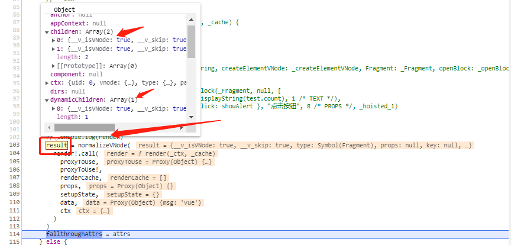

# 如何产生vnode？

1. 通过执行`app.mount('#app')`方法，在mount方法里面开始执行`render(vnode, rootContainer, isSVG)`packages\runtime-core\src\apiCreateApp.ts

  最后在 `finishComponentSetup`方法产出了模板render函数packages\runtime-core\src\component.ts
```js
// finishComponentSetup函数

Component.render = compile(template, finalCompilerOptions)
```

2. 得到模板render函数之后，回到`mountComponent`函数，接着执行`setupRenderEffect` packages\runtime-core\src\renderer.ts
```js
setupRenderEffect(
    instance,
    initialVNode,
    container,
    anchor,
    parentSuspense,
    isSVG,
    optimized
)
```

2-1.  `setupRenderEffect`可以说生成渲染函数的函数。通过封装`componentUpdateFn`函数,
- 给`ReactiveEffect`构造函数作为第一个参数
- 定义`update`, 并且作为`ReactiveEffect`构造函数作为第二个参数

```js
const effect = (instance.effect = new ReactiveEffect(
    componentUpdateFn,
    () => queueJob(update),
    instance.scope,
))

const update: SchedulerJob = (instance.update = () => effect.run())
update.id = instance.uid

update();
```

2-1. 紧接着就是执行`update()`, 直接说就是执行`componentUpdateFn`函数

- 初次渲染的时候，isMounted为false, 执行核心方法
 `const subTree = (instance.subTree = renderComponentRoot(instance))`(packages\runtime-core\src\renderer.ts)
  这个就是生成虚拟vnode的核心函数

```js
const componentUpdateFn = () => {
      // debugger
      if (!instance.isMounted) {
        if (el && hydrateNode) {
          
        } else {
          const subTree = (instance.subTree = renderComponentRoot(instance))

          patch(
            null,
            subTree,
            container,
            anchor,
            instance,
            parentSuspense,
            isSVG
          )
          
          initialVNode.el = subTree.el
        }

        instance.isMounted = true
      }
    }
```

3. `renderComponentRoot` 执行render函数生成vnode packages\runtime-core\src\componentRenderUtils.ts

```js
export function renderComponentRoot(
  instance: ComponentInternalInstance
): VNode {
  const {
    type: Component,
    vnode,
    proxy,
    withProxy,
    props,
    propsOptions: [propsOptions],
    slots,
    attrs,
    emit,
    render,
    renderCache,
    data,
    setupState,
    ctx,
    inheritAttrs
  } = instance
  
  let result

  try {
    if (vnode.shapeFlag & ShapeFlags.STATEFUL_COMPONENT) {
      const proxyToUse = withProxy || proxy
      result = normalizeVNode(
        render!.call(
          proxyToUse,
          proxyToUse!,
          renderCache,
          props,
          setupState,
          data,
          ctx
        )
      )
      fallthroughAttrs = attrs
    }
  } catch (err) {
    blockStack.length = 0
    handleError(err, instance, ErrorCodes.RENDER_FUNCTION)
    
  }

  return result
}
```

- proxyToUse是实例，执行模板render函数的上下文，withProxy的值是：

```js
installWithProxy = i => {
    if (i.render!._rc) {
        i.withProxy = new Proxy(i.ctx, RuntimeCompiledPublicInstanceProxyHandlers)
    }
}

if (installWithProxy) {
    installWithProxy(instance)
}
```

- 最终拿到vnode的值
<p>
  
</p>

- proxy的值是
```js
// packages\runtime-core\src\component.ts
instance.proxy = markRaw(new Proxy(instance.ctx, PublicInstanceProxyHandlers))
```

生成vnode取值的时候，就会触发get的操作符`RuntimeCompiledPublicInstanceProxyHandlers`or`PublicInstanceProxyHandlers`

4. vnode中有两个值为：children和dynamicChildren，拿到vnode之后，这就是就是vnode渲染成正式的DOM了
```js
patch(
    null,
    subTree,
    container,
    anchor,
    instance,
    parentSuspense,
    isSVG
)
```

## 总结
Vue把模板render生成vnode的过程封装成一个函数`componentUpdateFn`，保存``中,
- 当目的就是在执行模板render生成vnode，触发get操作符的时候，让响应式属性都收集到一个`ReactiveEffect`实例
  通过产生的vnode，传给`patch`渲染成真实dom

- 当触发的set操作符的时候，又可以执行`ReactiveEffect`实例中的`componentUpdateFn`，产生新的vnode
  传给`patch`新vnode和就vnode对比，渲染成真实dom

render函数有自定义的，也有编译编译生成的，他们的主要区别是Proxy的的操作函数不一样

- 编译生成函数的上下文取值，会执行`RuntimeCompiledPublicInstanceProxyHandlers`函数

- 自定义的render函数上下文取值，会执行`PublicInstanceProxyHandlers`函数


## 相关代码

- 模拟ReactiveEffect函数

```html
<!DOCTYPE html>
<html lang="en">
<head>
    <meta charset="UTF-8">
    <meta http-equiv="X-UA-Compatible" content="IE=edge">
    <meta name="viewport" content="width=device-width, initial-scale=1.0">
    <title>Document</title>
</head>
<body>
    <script>
        function ReactiveEffect(fn, scheduler) {
            this.fn = fn;
            this.scheduler = scheduler;
        }

        ReactiveEffect.prototype = {
            run: function() {
                this.fn()
            }
        }
        function setupRenderEffect() {
            var fn = function fn() { console.log('fn') };

            var effect = new ReactiveEffect(
                fn,
                () => {
                    setTimeout(update, 100)
                }
            )

            const update = () => effect.run()

            update()

            effect.scheduler()
        }
        setupRenderEffect()
    </script>
</body>
</html>
```

## 相关代码

- 调试代码

```html
<!DOCTYPE html>
<html lang="en">
<head>
  <meta charset="UTF-8">
  <meta name="viewport" content="width=device-width, initial-scale=1.0">
  <title>Document</title>
  <script src="../../dist/vue.global.js"></script>
</head>
<body>
  <div id="app">
    <div>
       {{msg}}
    </div>
    <div>stasut</div>
  </div>
  <script>  
    const { createApp } = Vue;
    
    var app = createApp({
      data() {
        return {
          msg: 'vue'
        }
      },
    })
    app.mount('#app')
  </script>
</body>
</html>
```