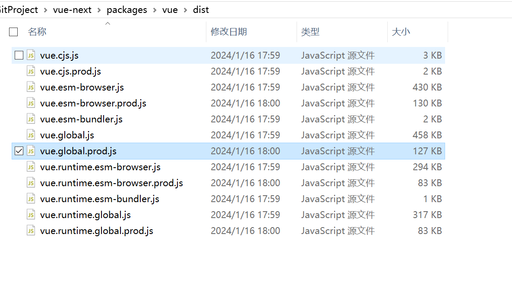

# Vue3的项目构建

>在github中fork一份Vu3的代码到自己的仓库，学习源码路程正式开始

## 安装依赖

1:该项目配置只能用pnpm安装，启动，在package.json的script中preinstall做了校验
```js
"preinstall": "node ./scripts/preinstall.js"
```
<p>
  
</p>

> 使用javascript Debug Terminal面板，debugger执行流程

## pnpm run dev命令执行流程

- 1. 先执行script文件夹中的dev.js, 改文件处理命令
        环境变量有：

        TARGET：需要编译的文件夹（有compiler-core, compiler-dom, reactivity等等）默认是vue文件夹；

        FORMATS：表示编译的格式

        COMMIT：git提交的日志

 案例：rollup -c --environment BUILD:production

 表示注入环境变量，可以通过process.env.BUILD拿到production的值

  实际上执行：
  `vue3构建命名：rollup -wc --environment COMMIT:xxx,TARGET:vue,FORMATS:global`

- 2. 解析命令行之后，就开始执行rollup.config.js文件

  获取TARGET文件夹的package.json的内容，既vue/pageage.json内容

  packageOptions = pkg.buildOptions 最终packageConfigs是一个数组
  ```js
    [{
        input: xxx/packges/vue/src/index.js,
        output: xxx/packges/vue/dist/vue.global.js
    }]
  ```
入口文件就是指向`packges/vue/src/index.js`

注意一点的就是在入口文件import的路径别名是在tsconfig.json配置的
配置项是：

```json
"paths": {
  "@vue/*": ["packages\/*\/src"],
  "vue": ["packages/vue/src"]
}
```
这时候就完成了yarn dev命令的构建

### npm run build vue命令执行流程


1. 该命令会执行`node scripts/build.js`, 执行`build.js`中的`run()`函数, 由于传入参数是`vue`, 表示只构建目录vue的代码

2. 执行打包配置`rollup.config.js`, 会产生12个打包配置保存在数组`packageConfigs`里面。配置参数是通过`createConfig`函数产生的

  格式类型是通过vue/packpage.json的`buildOptions`获取

3. 其中`createConfig`函数会判断入口文件是否有`runtime`关键字, 如果有，就把`vue/src/runtime.ts`作为入口文件进行打包，否则使用`vue/src/index.ts`作为入口文件

4. `vue/src/index.ts`可以看到引入了`@vue/compiler-dom`的compile函数，这个函数就是编译`html代码`的函数。因此runtime版本的代码体积少很多
```js
// packages\vue\src\index.ts
import { compile, CompilerOptions, CompilerError } from '@vue/compiler-dom'
// 注册compiler函数，使得代码体积变大的主要原因
registerRuntimeCompiler(compileToFunction)
```
<p>
  
</p>

### dist目录输出的格式化
- vue.cjs.js
CommonJS 适用于node

- vue.esm-browser.js
ES模块 别名esm, module。适用于现代浏览器包含有`<script type=module>`标识

- vue.global.js
iife，自执行函数，适用于`<script>`标识

- vue.runtime.esm-browser.js
es模块，vue简洁版，没有编译的函数代码, 适用于node的引入

- vue.runtime.global.js
iife 自执行函数，vue简洁版，没有编译的函数代码，适用于浏览器引入
## 执行单独模块： 
```
npm run dev template-explorer
```

## git fork代码保持与原代码同步

remote_origin 相当于 vue-next
```
git remote add remote_origin git@github.com:***/***.git

git fetch remote_origin

git merge remote_origin/master

```